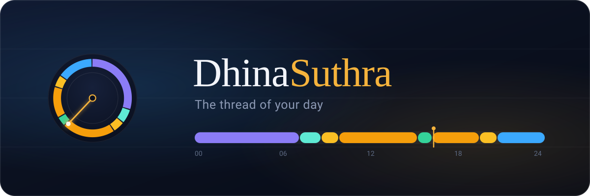
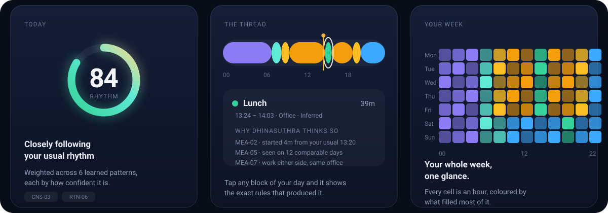
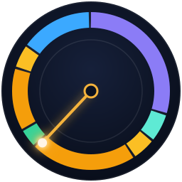

<div align="center">



<br><br>

<a href="https://github.com/PrashobhPaul/Dhinasuthra/releases/latest/download/dhinasuthra.apk">
  
</a>
&nbsp;&nbsp;
<a href="#how-it-thinks">
  
</a>

<br><br>


</div>

<br>

## Your day already has a shape. You've just never seen it.

You know roughly when you wake. You'd guess at when you eat. You'd swear you leave
at the same time every morning — and you'd probably be wrong by twenty minutes.

**DhinaSuthra watches quietly for a week.** No logging. No tapping. No streaks to
keep alive. Then it hands you the truth: your own 24 hours, drawn as a single
thread you can scrub through with your thumb.

<br>

<div align="center">
  
  <br>
  <sub><i>The visual language — a rhythm score, your day as a thread, your week at a glance.</i></sub>
</div>

<br>

### 🌙 It notices things you'd never bother to write down

> *"You started 18 minutes later than usual — and made most of it back before work."*
>
> *"Lunch began at 1:27. Three minutes off your normal."*
>
> *"Your sleep has drifted 34 minutes later over the last three weeks. Update your routine?"*

No score out of ten. No red badge for a bad day. Every sentence is measured against
one person only: **yesterday's you.**

### 🧭 It would rather say nothing than make something up

If it can't work out what you were doing between 11:40 and 12:25, it tells you it
can't — and offers you the chance to fill it in. Every conclusion comes with a
receipt: tap any block of your day and it tells you, in plain words, **exactly
what led it there** and how sure it is.

Most apps guess and hope you don't check. This one shows its working.

### ✋ And it asks before it decides

> *🍱 Lunch break · 12:52–13:42*
> *Detected from: you left your desk · you'd moved somewhere else · you came back*
> **[Yes, that's right] [Change] [Not this]**

Findings arrive as **questions, not verdicts**. One tap makes something history;
one tap changes it. Say *tea* at 10:42 a few times and it stops asking — that's
now simply when your tea break is. Nothing you've confirmed is ever quietly
rewritten by a later, cleverer version of the app.

### 🗄 Updating the app never costs you a day

Your history is the whole point, and it gets more valuable the older it gets. So
before an update touches the database it **takes a copy first**, checks every
record afterwards, and if anything at all goes wrong it puts the original back
rather than pressing on. There is no code path that deletes or resets your data
during an upgrade — and the upgrade is tested on every push against a
four-month-old database, not just a fresh install.

### 📺 It can see the parts of your day that aren't sensors

Answered calls — including WhatsApp and Teams, which never reach the phone's
call log — land on your timeline for exactly as long as you were connected.
Missed calls don't, because nothing happened. An evening in front of the TV
shows up too, named by what was playing.

None of that is on by default. Each is a switch in Settings, each explains what
it will and won't look at, and each stays completely dormant until you say yes.

### 🔒 Your day never leaves your phone

Not *"we don't sell your data"*. The app holds **no internet permission at all** —
it physically cannot transmit anything, anywhere. No account. No sign-in. No cloud,
no analytics, no ad ID, no model file phoning home. Export it or delete it, all of
it, in one tap.

### 🌀 And when you want to fall down a rabbit hole

**Time Lab** is where it stops being polite. Spin your day around a radial clock.
Watch a month of mornings as a heatmap. Fly around a **3D landscape of your last
45 days**, where the ridge at 9am is your commute and the canyon on Saturday is
your lie-in. Box plots, distributions, day-similarity matrices, percentile bands —
all of it computed on your phone, from you.

<br>

<div align="center">

## Get it

<a href="https://github.com/PrashobhPaul/Dhinasuthra/releases/latest/download/dhinasuthra.apk">
  
</a>

<sub>Always the newest build · Android 8.0+ · no Play Store account needed</sub>

</div>

**Three steps:**

1. **Download** the APK above on your phone.
2. **Open it.** Android will ask whether your browser or file manager may install
   unknown apps — say yes. It's a debug-signed build, so Play Protect may want a
   confirmation too.
3. **Say yes to location "all the time"** during onboarding. That one permission is
   what lets it notice you arriving and leaving while the app is closed. Everything
   still works if you decline; it just sees less.

> **Want the full experience in 30 seconds?**
> Go to **⚙️ Settings → Developer · Simulator → Load 45 days**. It pushes six weeks of
> realistic sensor signals through the *real* engine — not canned screenshots — so
> every chart fills in immediately.

<br>

---

<a name="how-it-thinks"></a>

## How it thinks

There's no AI model in here. No LLM, no neural net, no server doing the clever bit.
Its intelligence is **131 written rules**, each with an ID, a plain-English IF/THEN
statement, a weight, and the name of the code that enforces it.

You won't meet any of that while using the app — it shows you findings, not its
homework. But since this is where the curious end up, here are a few of the
opinions it refuses to compromise on:

| | |
|---|---|
| **SLP-01** | *Alarm dismissal is intent, not wakefulness.* Dismissing an alarm never ends your sleep — movement, repeated phone use or leaving the house does. |
| **WRK-01** | *Being at the office is not working.* Presence gets decomposed into work, meetings, lunch and breaks, and the two numbers are never shown as one. |
| **MEA-01** | *Lunch is never a hard-coded clock time.* If nothing in your history supports it, the window stays unclassified. |
| **LOC-05** | *Park, walk, arrive — one arrival.* Parking the car and walking to your door is a single event, not four. |
| **TML-02** | *Unexplained time is labelled, not invented.* |
| **NAR-01** | *Silence beats a filler insight.* |

Because they're just rules, they're testable — and they are: the unit suite asserts
the catalogue's integrity, the 24-hour invariant, wake confirmation, lunch
inference, work decomposition and the rest on every push.

<br>

## The five places you'll spend your time

| | |
|---|---|
| **Today** | How's it going, what did it notice, what's next, how close is this to your normal. |
| **Timeline** | What actually happened — every episode with its status and evidence, plus the handful of moments waiting on a yes or no. Long-press to correct anything, and your correction outranks the engine forever after. |
| **Insights** | What changed and why it matters. Ranked, hedged, never padded. |
| **Routine** | Turn a pattern you keep repeating into a timetable, then see planned against actual. When life moves, it offers to move the plan instead of nagging you. |
| **Time Lab** | Everything. Range × lens × view, and the 3D landscape. |

<br>

---

<details>
<summary><b>Under the hood</b> — architecture, data model and the honest gaps</summary>

<br>

### One canonical time model

Every day is a set of `TimeEpisode`s — activity + location + confidence + status
(observed / inferred / confirmed / corrected) — that tile the day exactly. No
overlaps, no holes, 1440 minutes, with unexplained stretches labelled rather than
invented and today stopping at *now* instead of fabricating nine unknown evening
hours.

### The rule that governs every chart

**Activity and location are never aggregated together.** "Sleep 8h" and "Home 15h"
in the same pie chart double-counts the day and answers two different questions at
once. So there are exactly three legal projections — Activity, Location, and
Activity @ Location — and `LensProjector` is the only way to build one.

| Layer | What's inside |
|---|---|
| Sensing | Geofencing, Activity Recognition transitions, 15-minute context samples (screen / charging / last-known location), live screen + charger transitions, boot + timezone recovery |
| Optional signals | Answered calls from the system log; WhatsApp and Teams calls via an ongoing-call notification, reading no text of any kind; TV and viewing time from usage access, restricted to a short list of remote and video apps. All opt-in, all off until switched on |
| Context fusion | Debounced state machine → HOME / OFFICE / TRAVEL / KNOWN_PLACE / UNKNOWN_STAY segments in Room |
| Reconciliation | Crossings raise *candidates*; dwell, continuity and context confirm them before anything is written to history |
| Interpreters | Sleep, meals, work decomposition, commute, gap resolution — each pure Kotlin, each returning the evidence ledger that produced it |
| Activity detection | An awakening state machine for wake, one boundary engine for breaks and interruptions, contextual windows for lunch and tea, TV and call signals — registered rather than chained, so a new one is an entry in a list |
| Lifecycle | Inferred → confirmed or corrected → trusted history. Corrections supersede rather than erase; only provisional findings are ever recomputed; raw observations are immutable |
| Migrations | Additive, idempotent, validated before the version is accepted, snapshotted beforehand, restored on failure. Never destructive, never on startup |
| Patterns | Median, IQR, SD, percentiles, consistency, Tukey outlier exclusion, and a lifecycle: Learning → Emerging → Established, plus Unstable and Stale |
| Routines | Timetables with per-entry tolerance derived from your own spread; transparent adherence arithmetic; drift proposals |
| Narration | Insights ranked by significance, hedged in proportion to confidence, each carrying its measurement |
| Place intelligence | On-device stay clustering, home/office hypotheses, discovery suggestions, custom names and categories |
| Reminders | Local AlarmManager notifications with cooldowns, dismissal suppression, quiet hours and a daily budget. A day with zero reminders is a success |
| Privacy controls | Pause 1h / today, master tracking switch, privacy dashboard, JSON & CSV export, full delete |

### Repository layout

```
app/src/main/java/com/dhinasuthra/app/
  core/         models, Room database, time provider, utils
  context/      context fusion state machine, sleep estimator
  places/       place learner (clustering, hypotheses, suggestions)
  routine/      stats, learning engine (+ priors), adherence, greetings
  reminders/    scheduler, receivers, notification copy
  sensing/      geofencing, activity recognition, policy engine, boot receiver
  work/         WorkManager jobs (samples, rollups, reminder planning)
  analytics/    daily rollup + summary writer
  export/       JSON/CSV export, delete-all
  simulate/     debug-only synthetic-day driver
  intelligence/ rule book, episode model, reconciler, interpreters,
                pattern/statistics engines, lenses, narration, timetables
  ui/           Compose: design tokens, safe-area foundations, visualisation
                library (ribbon, radial, heatmaps, charts, 3D landscape),
                Today / Timeline / Insights / Routine / Time Lab / More
```

### Build it yourself

Requirements: JDK 17+ (21 recommended), Android SDK 35.

```bash
gradle assembleDebug        # or ./gradlew assembleDebug
adb install app/build/outputs/apk/debug/app-debug.apk
```

CI runs the unit suite, builds the APK, and fails the build if `INTERNET` ever
appears in the merged manifest or an unreviewed permission is requested. Pushes to
`main` publish the APK to the release the download button points at.

### Battery-restricted OEMs

Xiaomi / Oppo / Vivo / OnePlus kill background apps aggressively. If moments stop
appearing, exempt DhinaSuthra from battery optimisation. The app never uses a
permanent foreground service or other keep-alive hacks.

### Honest gaps

- Work-from-home and travel-day routine clusters beyond weekday/weekend
- Place merge / split tooling
- Bulk historical entry (single-day backdated entry works today)
- Tolerance that adapts to how you dismiss reminders
- String extraction for Malayalam / Hindi / Telugu / Tamil / Kannada — copy still
  lives in Kotlin
- Import / restore of exported data
- Internet-call detection infers "connected" from a running call timer in the
  notification, which is a strong signal but still a heuristic
- Only the remote and video apps on a built-in list are recognised for viewing
  time; an unlisted app is invisible rather than mislabelled
- Release signing: builds are currently debug-signed

</details>

<br>

## Privacy, in one paragraph

Sensors → a database on your device → engines on your device → notifications on
your device. Raw sensor rows are pruned after 60 days, context after 180. There is
no code path to the network, and continuous integration fails if one ever appears.
Full detail in [`docs/privacy.md`](docs/privacy.md).

<br>

<div align="center">



<sub>© 2026 Prashobh · see <a href="LICENSE">LICENSE</a> · built for people who are curious about their own time.</sub>

</div>
